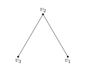

第 37 届 CMO 在大概半个月前举办, 据说这次比赛的题目难度不算大,
考的都是一些比较常规的东西. 在飞回广东的航班上, 我便尝试着做了做 Problem 4.


A conference is attended by $n (n \ge 3)$ scientists. Each scientist has some
friends in this conference (being friends is mutual, and no one is considered a
friend of him/herself). Assume that, no matter how we separate these scientists
into two nonempty groups, there always exist two scientists from the same group
who are friends, and there always exist two scientists from the different
groups who are friends.

A proposal is introduced on the first day of the conference. Each of the
scientists' opinion on the proposal can be represented by a nonnegative
integer. Everyday from the second day onward, each scientist's opinion on the
proposal is changed to the integer part of the average of all his/her friends'
opinions on the proposal from the previous day.

Prove that, after a period of time, all these scientists have the same opinion
on this proposal.



Ok, 我们用图论的语言来翻译一下题目的第一段.

Let $G$ be a graph with $|G| = n$, the condition is
for any partion $G = A \sqcup B$, there always exists $u, v; x, y$
such $u$ 与 $v$ 相邻, $x$ 与 $y$ 相邻,  $u, v$ 在同一个集合里,
$x, y$ 在不同一个集合里. 为了方便叙述, 我们把这个性质称为性质 $(\star)$,
并把不满足这个性质的 partion 称为一个**坏的分组**.


我感到有点头疼, 从这个条件能推出什么东西呢?
我首先注意到的是


For all $g \in G, \deg g \ge 1$.


稍微想了想, 我发现其实更进一步能知道


$G$ 只有一个连通分支, 或者说, 对任意 $u, v \in G$, 存在一条连接 $u, v$ 的路径.



事实上, 如果 $G$ 有多余一个连通分支, 那么任选一个连通分支作为 $A$,
就得到一个坏的分组.


做到这里, 我就暂时看不出从性质 $(\star)$ 还能有什么眉目.

那我们先继续看第二段吧, denote by $f(i, k)$ the $i$-th scientist's opinion on day $k$ (理解成图中一个点的分值).
我们要证明的是对充分大的 $k, f(i, k) = f(j, k)$ for all $1 \le i,j \le n$.
我还考虑了以下三个变量, 因为我认为之后可能会用到:

$$
S_k := \sum_{j=1}^n f(j, k), \quad B_k := \max_{1 \le j \le n} f(j, k), \quad A_k := \min_{1 \le j \le n}f(j, k).
$$

此外, 我们再 in particulr 记 $a_i := f(i, 1)$ 为各点的初始分值.

我先证一下 $n = 3$ 的情形好了, 看看能不能从中得到什么启迪.
因为 $G$ 只有一个连通分支, 所以 $G$ 至少得满足:

{{}}

实际上 $v_1$ 也必须连接 $v_3$, 即 $G$ 是 $3$-完全图.
因为否则的话, $\\{v_3, v_1\\}$ 作为 $A$ 就是一个坏的分组.
现在 $G$ 是 $3$-阶完全图, 边的数量足够多, 那就好办了.

首先 $S_{k+1} \le S_k$, 这是因为取整可能会吃掉一个 $\frac{1}{2}$,
又因为 $S_k \ge 0$ for all $k \in \mathbb{N}$, 所以 $S_k$ eventually constant.
我们不妨一开始就假设 $a_1\le  a_2\le a_3$ 奇偶性相同,
一天之后, 变成了 $\frac{1}{2}(a_2 + a_3), \frac{1}{2}(a_3 + a_1), \frac{1}{2}(a_1 + a_2)$.
一开始的时候 $v_1$ 是分值最小的, $v_3$ 是最大的,
现在 $v_1$ 是最大的, $v_3$ 是最小的, 最神奇的是, 他们的分值差从
$B_1 - A_1 = a_3 - a_1$ 变成了 $B_2 - A_2 = \frac{1}{2}(a_2 + a_3 - a_1 - a_2) = \frac{1}{2}(a_3 - a_1)$,
缩小了一半. 所以 eventually $A_k = B_k$, 这就证完了.

$n = 3$ 的情形给了我以下启迪, 要证明 $f(i, k) = f(j, k)$ for all $1 \le i,j \le n$,
只续证明 **$B_k - A_k$ 随着 $k$ 增大 eventually 越来越小即可**.
我发现让 $B_k$ 变小是很容易的一件事, 因为 $f(i, k)$ 是一堆数求平均之后再取整,
那只要求和中的一个数严格比 $B_{k-1}$ 小, 得到的 $f(i, k)$ 也一定严格比 $B_{k-1}$ 小, 即


要使 $B_{k+1} = B_k$, 当且仅当存在一个点 $v$, 使得与它相邻的点分值都是 $B_k$.


我发现, 只要我能证明 $B_k$ 能相比较 $B_1$ 缩小一次,
那么把缩小后的 $B_k$ 视作新的初始值, 就能反复套用结论让 $B_k$ 不断的缩小.
于是问题现在归结为: 存在 $k \in \mathbb{N}$, 使得 $B_k < B_1$.

接着, 我又分析了 $n = 3$ 的情形中, 如果 $v_1, v_3$ 不相邻, 也就是条件 $(\star)$ 被破坏了,
这个时候为什么结论就不对了? 第一天是 $(a_1, a_2, a_3)$, 第二天变成 $(a_2, \frac{1}{2}(a_1 + a_3) =: b, a_2)$,
第三天变成 $(b, a_2, b)$, 第四天变回 $(a_2, b, a_2)$, 就这样陷入死循环了.
我把表达式写出来, 就是

$$
f(2, 3) = \frac{1}{2}(f(1, 2) + f(3, 2)) = \frac{1}{2}(f(2,1) + f(2,1)) = a_2.
$$

我感觉到自己似乎已经摸到答案的边缘了!
之所以会陷入死循环, 是因为 $f(2, 2k + 1)$ 的表达式完全不依赖于 $a_1, a_3$.
条件 $(\star)$ 的作用应该就是让 $f(i, k)$ 的表达式依赖的 $a_j$ 的个数尽可能多.


$f(i, k)$ 是 $a_1, \cdots, a_n$ 的加权平均, 也就是说,
存在 $c_{1,k}, \cdots, c_{n,k} \in \mathbb{Q}_{\ge 0}$, $c_{1,k} + \cdots + c_{n,k} = 1$,
满足 $f(i, k) \le c_{1,k}a_1 + \cdots + c_{n,k}a_n$.


就像前面所说的, 只要加权当中某个 $a_j$ 不是最大值 $B_1$,
并且 $c_{j,k} \ne 0$ (即 $a_j$ 对加权平均有 non-trivial 贡献),
那么 $f(i, k)$ 就一定严格小于 $B_1$. 什么时候 $c_{j, k}$ 非零?


$c_{j,k} \ne 0$ 当且仅当存在一条长度为 $k$ 的路径连接 $a_i, a_j$.


注意到, 如果存在一条长度为 $k$ 的路径连接 $a_i, a_j$,
那我们可以通过"反复横跳"的方式找到长度为 $k + 2t, t \in \mathbb{N}$ 的路径连接 $a_i, a_j$.
原理就好比假如 $a_1, a_2$ 相邻, 那么 $a_1 \to a_2 \to a_1 \to a_2$ 就是长度为 $3$ 的路径.

我们前面发觉的  派上用场了:
它保证了 $c_{j,k}$ 不可能一直为 $0$ for all $k$,
因为对任意 $a_i, a_j$, 连接这两点的路径总是存在.

$n = 3$ 的情形中如果 $v_1, v_3$ 不相邻, 结论之所以不成立,
是因为 $v_1, v_3$ 都只能通过长度为奇数的路径连接 $v_2$,
所以 $a_1, a_3$ 在 $f(2, 2k+1)$ 的加权系数中为 $0$.
这时候出现了 **$c_{j,k}$ 是否为 $0$ 依赖于 $k$ 的奇偶性**.
我们不希望这种情形发生, 我们希望的是当 $k$ 充分大以后, $c_{j,k}$ 就一直非零了.


如果 $G$ 的一个点 $v$ 存在奇数长度的圈 (cycle),
那么同样可以通过"反复横跳"的方式使得对任意两点 $a_i, a_j$,
既有长度为奇数的路径, 也有长度为偶数的路径连接它们.


等等, 存在奇数长度路径连接, 存在长度偶数路径连接, 不恰好是两个分组吗?
设 $v \in G$ 是其中任意一点, 我们取 $A$ 为所有与 $v$ 的路径长度是奇数的点构成的集合,
$B$ 为所有与 $v$ 的路径长度是偶数的点构成的集合.

如果存在如  所说的奇 cycle,
那么实际上我们有 $A = B = G$; 反之, 如果那样的奇 cycle 不存在,
那么 $A, B$ 就确实构成一个 $G$ 的划分,
并且此时 $A, B$ 中的点都两两不相邻.

于是 $A, B$ 就构成了一个坏的分组, 矛盾, 矛盾的根源在哪?
矛盾的根源在于不可能出现 $c_{j,k}$ 是否为 $0$ 要依赖于 $k$ 的奇偶性.
原来, 条件 $(\star)$ 的最终用途是在这里, 他除了保证 $G$ 的连通性以外,
还保证了**对 $G$ 的任意两点, 既有长度为奇数的路径连接它们,
也有长度为偶数的路径连接它们**.

这题给我一种"点到为止", "恰到好处"的感觉, 个人认为是非常漂亮的一题.


手稿



手稿




后来我和朋友讨论起这题, 我才意识到所谓的性质 $(\star)$ 就是在说 $G$ 不是二分图.
It is well-known that 一个图 $G$ 可以二分当且仅当 $G$ 存在 odd-cycle.



