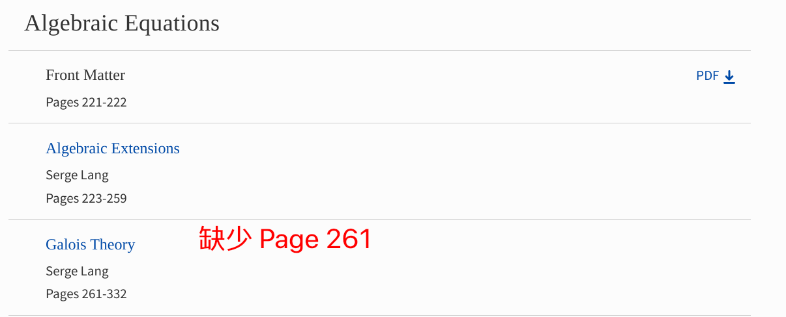

今天我看到 WeChat 朋友圈里有人转发这样一条[推送](https://mp.weixin.qq.com/s/EjU4FCN9o37uRfyxYuEmjA),
说是福昕 PDF 编辑器 (教育专享版) 正式入驻北京大学正版软件共享平台啦,
北大师生可以免费使用.

作为一个学数学的人, PDF 自然是我最青睐的文档格式. 首先,
它可以由 LaTeX 直接编译生成, 得到的 PDF 文档质量极高;
其次, 它能忠实且精准地还原文稿的每一个字符, 颜色和图像,
不会出现像 Word 那样, 因为电脑里没安装某些东西, 导致在不同的电脑里,
即使是同一份文稿也会有不一样的显示效果;
最后, 那就是 PDF 很轻量, 即使是上百页甚至上千页的 PDF,
几乎都可以在一瞬间被读入, 至于 Word, 我想应该不会有人去打开一个上千页,
文档大小上百 MB 的 `.doc` 文件吧.

我会在这篇文章展示我如何利用 `cpdf` 来编辑 GTM 211, let's get started.

## Download GTM 211 from official

如果你是一个学生, 能够使用教育网, 你可以直接在
[Springer](https://link.springer.com/book/10.1007/978-1-4613-0041-0) 下载.

## 插入空白页

我们首先可以注意到, 一上来的 Chapter 1 Groups 居然就已经是 Page 3 了,
请问 Page 2 哪去了? 事实上, 这是因为这本书本质是一本纸质书,
这些书在设计的时候, 会刻意让每一 Part 的封面位于奇数页 $2n + 1$,
然后正文从 $2n + 3$ 页开始. 然后因为 $2n + 2$ 页空白没有内容,
所以估计 Springer 在制作 PDF 的时候, 就自作主张的不收录这些空白页.

真正的 Page 1 在 PDF 里对应 Page 17, offset 为 16.
我会用 $n (+16), n (-16)$ 来表示真实的第 $n$ 页和 PDF 的第 $n$ 页.
现在因为第 $2 (+16)$ 页没了, 所以第 $18 (-16)$ 页居然被错误的解读成第 $3 (+16)$ 页.

{{}}

查阅 [manual](https://www.coherentpdf.com/cpdfmanual.pdf) 知我们可以通过

```
$ cpdf -pad-before in.pdf 18 -o in.pdf
```

在第 $18 (-16)$ 页前插入一个空白页.

{{}}

同理第 $260 (+16)$ 页也是缺失的, 以此类推, 找到所有缺失的页码,
然后通过

```
$ cpdf -pad-before in.pdf 276 -o in.pdf
$ cpdf -pad-before in.pdf 392 -o in.pdf
$ cpdf -pad-before in.pdf 464 -o in.pdf
$ cpdf -pad-before in.pdf 480 -o in.pdf
$ cpdf -pad-before in.pdf 516 -o in.pdf
$ cpdf -pad-before in.pdf 518 -o in.pdf
$ cpdf -pad-before in.pdf 746 -o in.pdf
$ cpdf -pad-before in.pdf 890 -o in.pdf
$ cpdf -pad-before in.pdf 910 -o in.pdf
$ cpdf -pad-before in.pdf 918 -o in.pdf
```

来插入空白页. 完成以上操作后, 我们的 PDF 满足:
**书本真实的第 $n$ 页, 对应 PDF 里的第 $n + 16$ 页**.

## 添加逻辑页码

现在 offset 为 16, 也就是说 front matter 有 16 页.
我们希望

  - 第 $17 (-16)$ 页开始到文档的结尾用阿拉伯数字 $1, 2, \cdots$ 来 label.
  - 第 $1 (-16)$ 页是封面, 用 C1 来 label.
  - 第 $2 (-16)$ 页到第 $16 (-16)$ 页是 front matter,
  包含 Foreword (序言), Logical Prerequisites (预备知识),
  以及 Contents (目录), 用小写罗马数字 i 到 xv 来 label.

查阅 Manual 后, run the following command:

```
$ cpdf -add-page-labels in.pdf 1 -label-style NoLabelPrefixOnly -label-prefix "C1" -o in.pdf
$ cpdf -add-page-labels in.pdf 2-16 -label-style LowercaseRoman -o in.pdf
$ cpdf -add-page-labels in.pdf 17-end -o in.pdf
```

其中 `end` 被 `cpdf` 解读为 PDF 最后一页的页码,
且因为阿拉伯数字是默认的 page label, 所以不用特别注明 `-label-style DecimalArabic`.

{{}}

## 添加 Bookmark

这一步只能照着目录手打, 创建文件 `bookmark.txt` 包含内容如下:

```
0 "Cover" 1
0 "Foreword" 6
0 "Logical Prerequisites" 10
0 "Contents" 12
0 "Part 1 - The Basic Objects of Algebra" 1
0 "Chapter 1 - Groups" 3
0 "Chapter 2 - Rings" 83
0 "Chapter 3 - Modules" 117
0 "Chapter 4 - Polynomials" 173
0 "Part 2 - Algebraic Equations" 221
0 "Chapter 5 - Algebraic Extensions" 223
0 "Chapter 6 - Galois Theory" 261
0 "Chapter 7 - Extensions of Rings" 333
0 "Chapter 8 - Transcendental Extensions" 355
0 "Chapter 9 - Algebraic Spaces" 377
0 "Chapter 10 - Noetherian Rings and Modules" 413
0 "Chapter 11 - Real Fields" 449
0 "Chapter 12 - Absolute Values" 465
0 "Part 3 - Linear Algebra and Representations" 501
0 "Chapter 13 - Matrices and Linear Maps" 503
0 "Chapter 14 - Representation of One Endomorphism" 553
0 "Chapter 15 - Structure of Bilinear Forms" 571
0 "Chapter 16 - The Tensor Product" 601
0 "Chapter 17 - Semisimplicity" 641
0 "Chapter 18 - Representations of Finite Groups" 663
0 "Chapter 19 - The Alternating Product" 731
0 "Part 4 - Homological Algebra" 759
0 "Chapter 20 - General Homology Theory" 761 
0 "Chapter 21 - Finite Free Resolutions" 835
0 "Appendix 1 - The Transcendence of e and π" 867
0 "Appendix 2 - Some Set Theory" 875
0 "Bibliography" 895
0 "Index" 903
```

前面说过 offset 是 16, 所以要把 1 改成 17, 3 改成 19, 83 改成 99,
以此类推. 逐个人工计算实在太麻烦了, 好在我们可以用 Neovim 的宏录制功能:
鼠标前往第 4 行, 按 `qw` 开始宏录制, `j^f";w16<c-a>`,
然后再按一下 `q` 结束宏录制, finally see the magic by `99@w`.

```
0 "Cover" 1
0 "Foreword" 6
0 "Logical Prerequisites" 10
0 "Contents" 12
0 "Part 1 - The Basic Objects of Algebra" 17
0 "Chapter 1 - Groups" 19
0 "Chapter 2 - Rings" 99
0 "Chapter 3 - Modules" 133
0 "Chapter 4 - Polynomials" 189
0 "Part 2 - Algebraic Equations" 237
0 "Chapter 5 - Algebraic Extensions" 239
0 "Chapter 6 - Galois Theory" 277
0 "Chapter 7 - Extensions of Rings" 349
0 "Chapter 8 - Transcendental Extensions" 371
0 "Chapter 9 - Algebraic Spaces" 393
0 "Chapter 10 - Noetherian Rings and Modules" 429
0 "Chapter 11 - Real Fields" 465
0 "Chapter 12 - Absolute Values" 481
0 "Part 3 - Linear Algebra and Representations" 517
0 "Chapter 13 - Matrices and Linear Maps" 519
0 "Chapter 14 - Representation of One Endomorphism" 569
0 "Chapter 15 - Structure of Bilinear Forms" 587
0 "Chapter 16 - The Tensor Product" 617
0 "Chapter 17 - Semisimplicity" 657
0 "Chapter 18 - Representations of Finite Groups" 679
0 "Chapter 19 - The Alternating Product" 747
0 "Part 4 - Homological Algebra" 775
0 "Chapter 20 - General Homology Theory" 777 
0 "Chapter 21 - Finite Free Resolutions" 851
0 "Appendix 1 - The Transcendence of e and π" 883
0 "Appendix 2 - Some Set Theory" 891
0 "Bibliography" 911
0 "Index" 919
```

最终我们的 `bookmark.txt` 的内容如上, 必须确保第三行的数字对应的是 PDF 的页码,
而不是书本的真实页码. Now add the bookmarks to the input file by

```
$ cpdf -add-bookmarks bookmark.txt in.pdf -o out.pdf
```

现在我们的 PDF 便有了 Bookmark.

{{}}

最后再将这个 PDF 适当的命名, 我个人的 preference 是

```
<AUTHOR> - <BOOK TITLE> - <ADDITIONAL INFO> - <SERIES>.pdf
```

其中 `<AUTHOR>` 和 `<BOOK TITLE>` 是必须的, 剩下两个 optional.
一般 GTM 的书我都会加上 `<SERIES>`, 比如 Serge Lang 这本就是 GTM 211.
此外, 第几个 Edition 也是相对重要的信息, 这本书是 Revised Third Edition,
第三次订正.

最后, 我们把这个 PDF 放进 `~/Documents/Book/` 给统一收藏起来,
假如刚好这学期我有一门课要以这本书作为教科书, 那么我就会通过

```
ln -s ~/Documents/Book/'Serge Lang - Algebra - Revised Third Edition Volume 1 - GTM 211.pdf' ~/Desktop/textbook.pdf
```

来创建一个 symbolic link (相当于 MACOS 或 PC 下的快捷方式).
这样的好处是让你的电脑更加 tidy, 所有的电子书统一放在一个文件夹管理.
此外也更方便备份, 还能防止误删.
